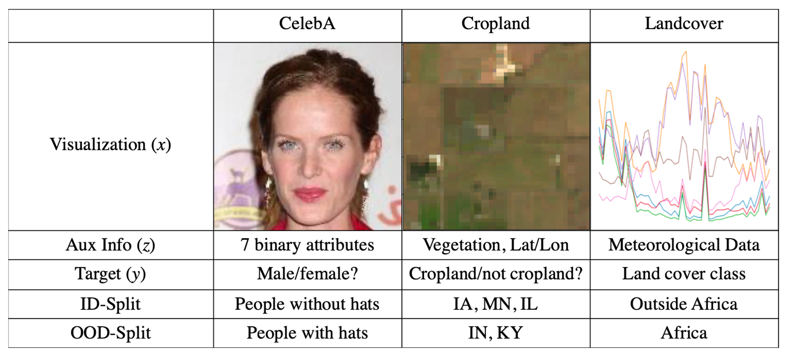

# 🍔 In-N-Out: Pre-Training and Self-Training using Auxiliary Information for Out-of-Distribution Robustness (ICLR 2021)

This repo contains the experiments for the ICLR 2021 [paper](https://arxiv.org/abs/2012.04550):
```
@inproceedings{xie2021innout,
  author = {Sang Michael Xie and Ananya Kumar and Robbie Jones and Fereshte Khani and Tengyu Ma and Percy Liang},
  booktitle = {International Conference on Learning Representations (ICLR)},
  title = {In-N-Out: Pre-Training and Self-Training using Auxiliary Information for Out-of-Distribution Robustness},
  year = {2021},
}
```

The main script is in `innout/main.py`. The script requires a YAML config
file - an example is `configs/landcover/CNN1D.yaml`.
To dynamically change values of the config file with command line arguments,
simply add new arguments of the form `--key=val` where the key can be any
string of multiple keys separated by periods. This is to allow for changing
nested components of the config file. For example `--model.args.depth=3` changes
the config dictionary in this way: `config['model']['args']['depth'] = 3`.
It is important that the key and value are separated by an equals sign.

Examples of how to run the main script on our datasets are in `scripts/`.

## Steps to run an experiment

The first time you run this project, create a virualenv in the current directory (which contains the README):
```
python3 -m venv .env
source .env/bin/activate
pip install -e .
```
In subsequent runs you only need to activate the environment:
```
source .env/bin/activate
```

## Datasets
In-N-Out does better than all other methods on two real-world remote sensing datasets: Landcover and Cropland, and one standard ML benchmark dataset, CelebA. In this [CodaLab worksheet](https://worksheets.codalab.org/worksheets/0x2613c72d4f3f4fbb94e0a32c17ce5fb0), we show all our code and runs for these experiments for reproducibility. The data can also be downloaded from the CodaLab worksheet.



Here is an example run of the baseline model for Landcover (see others on the CodaLab worksheet):
```
python innout/main.py 
    --dataset.args.unlabeled_prop=0.9
    --epochs=400
    --scheduler.num_epochs=400
    --seed=112
    --dataset.args.seed=1
    --group_name=landcover
    --dataset.args.include_ERA5=False
    --model.args.in_channels=8
    --config=configs/landcover/CNN1D.yaml
    --model_dir=models/landcover_unlabeledprop_0.9/landcover_baseline_unlabeledprop0.9_trial1
    --run_name=landcover_baseline_unlabeledprop0.9_trial1
    --no_wandb
    --return_best
```
